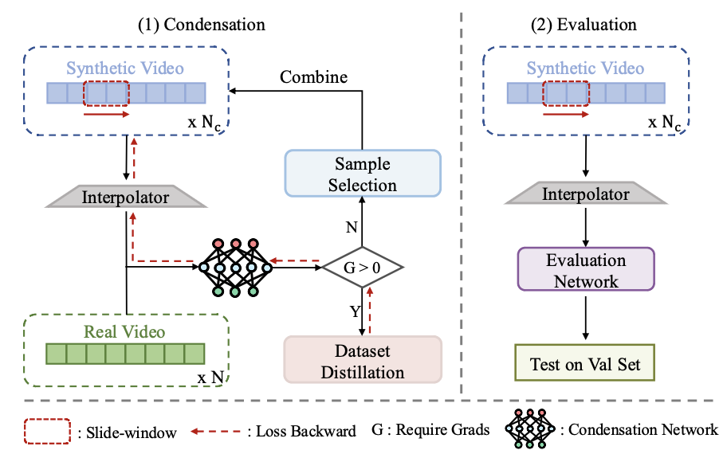

# Video-DC

The official implementation of [A Large-Scale Study on Video Action Dataset Condensation](https://arxiv.org/abs/2412.21197)

Authors: Yang Chen, Sheng Guo, Limin Wang.



In this work, we mainly explore three main aspects of vidoe dataset condensation: temporal processing method, evaluation settings and condensation algorithms. We are excited to release our evaluation code along with an example condensation algorithm, RDED. The rest of the code will be made available soon.

## Preparation

### Installation
``` shell
conda create -n videodc python=3.11
conda activate videodc
pip install torch==2.1.1 torchvision==0.16.1 torchaudio==2.1.1 --index-url https://download.pytorch.org/whl/cu118 # Our code is primarily running on Pytorch 2.1.1 with cuda11.8

pip install -U openmim
mim install mmengine
mim install mmcv==2.1
cd mmaction2
pip install -v -e .
pip install accelerate, importlib-metadata, wandb
```

### Data
Following [mmaction documents for dataset preparation](https://mmaction2.readthedocs.io/en/latest/datasetzoo_statistics.html), perpare UCF101, HMDB51 and K400 seperately and put them under the direction './mmaction2/data'. 

### Condensation Model
You can train the model using MMACTION2 with the script located in `mmaction2/configs/recognition/conv3`. Or, you can download the checkpoints from [Google Drive](https://drive.google.com/drive/folders/1VTNVohMm6mlV12Y2-4493ywys_miNNI6?usp=share_link).

## Scripts for evaluation
You can use this script to evaluate the condensed dataset:
```
CUDA_VISIBLE_DEVICES=<GPU_IDS> python val.py --config config/<your config>
```
In this work, one gpu is enough for evaluation.  You need to set the path to the condensed dataset in config files. More explainations are available in the example config file 'config/ucf-rded.yaml'.

## Scripts for condensation

### RDED
Firstly, you need to set the path of checkpoints in `./rded/argument.py`. Then, you can use this script to condense the dataset:
```
cd rded
bash scripts/ucf101-rded-distill-conv4-cr5.sh <IPC> <GPU-id>
```

## Contact
- Yang Chen: yangchen4sun@gmail.com

## Acknowledge
- [Awesome Dataset Distillation](https://github.com/Guang000/Awesome-Dataset-Distillation?tab=readme-ov-file)
- [RDED](https://github.com/LINs-lab/RDED)
- [EDC](https://github.com/shaoshitong/EDC)
- [DATM](https://github.com/NUS-HPC-AI-Lab/DATM)